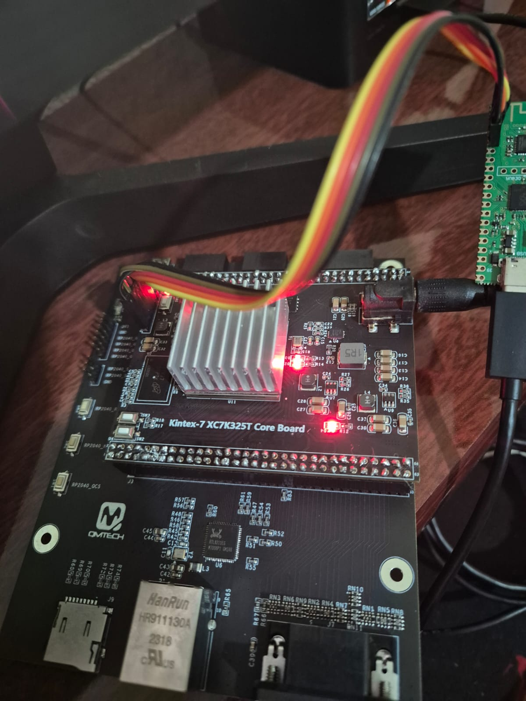

# 🔥 DuinoCoin FPGA Miner - Kintex-7 XC7K325T

**High-performance cryptocurrency miner implementado em FPGA usando 70 cores SHA-1 em paralelo**



---

## 📋 Visão Geral

Este projeto implementa um minerador otimizado para **DuinoCoin** usando a placa FPGA **QMTECH Kintex-7 XC7K325T**. A implementação utiliza **70 cores SHA-1 processando em paralelo**, alcançando throughput significativamente superior comparado a implementações em CPU.

### 🎯 Características Principais

- **70 cores SHA-1 em paralelo** - Processamento simultâneo de 70 nonces diferentes
- **Placa QMTECH Kintex-7 XC7K325T** - FPGA com 325.600 células lógicas
- **Clock de 50MHz** - Oscilador on-board
- **Comunicação UART 9600 baud** - Interface com o servidor DuinoCoin
- **Operação Full-Duplex** - Recepção e transmissão simultâneas de dados
- **Reconexão automática** - Tratamento robusto de falhas de rede
- **Log de rejeições** - Registro detalhado de shares rejeitadas para debugging
- **Performance: 40 MH/s** - 40.000 kH/s com 70 cores paralelos

---

## 🏗️ Arquitetura de Hardware

### Fluxo de Dados

```
┌─────────────────────────────────────────────────────────────┐
│                    TOP MODULE (top.v)                       │
├─────────────────────────────────────────────────────────────┤
│                                                              │
│  ┌──────────────────────────────────────────────────────┐   │
│  │         MÁQUINA DE ESTADOS SHA-1                    │   │
│  │  (Controla 70 cores em paralelo)                    │   │
│  └──────────────────────────────────────────────────────┘   │
│           ▲                                    ▼             │
│           │                                    │             │
│  ┌────────┴────────────────────────────────────┴────────┐   │
│  │  70 cores SHA-1 (sha1_core.v)                       │   │
│  │  - sha1_core_0 (nonce_0)                            │   │
│  │  - sha1_core_1 (nonce_0 + 1)                        │   │
│  │  - ...                                               │   │
│  │  - sha1_core_69 (nonce_0 + 69)                      │   │
│  └────────────────────────────────────────────────────────┘   │
│           ▲                                    ▼             │
│           │                                    │             │
│  ┌────────┴──────────────────────────────────┴───────────┐   │
│  │  Conversor BCD (nonce_bcd_simple.v)                  │   │
│  │  - Converte nonce para string ASCII                  │   │
│  │  - Suporta até 10 dígitos (max 32 bits)             │   │
│  └────────────────────────────────────────────────────────┘   │
│                          ▼                                   │
│  ┌────────────────────────────────────────────────────────┐   │
│  │  UART TX/RX (uart_tx.v / uart_rx.v)                 │   │
│  │  - 9600 baud                                         │   │
│  │  - Protocolo: 80 bytes (msg+hash) → 4 bytes (nonce) │   │
│  └────────────────────────────────────────────────────────┘   │
│           ▲                                    ▼             │
└───────────┼────────────────────────────────────┼──────────────┘
            │                                    │
         RX_PIN                              TX_PIN
```

### Máquina de Estados SHA-1

```
┌─────────────┐
│   STATE_    │
│   RESET     │ ◄─── Inicialização
└──────┬──────┘
       │
       ▼
┌─────────────┐
│   STATE_    │ ◄─── Aguarda buffer completo + cores prontos
│    IDLE     │
└──────┬──────┘
       │ (buffer cheio & cores prontos)
       ▼
┌──────────────────┐
│   STATE_INIT_    │ ◄─── Dispara os 70 cores simultaneamente
│    SHA1          │      com MESSAGE_BLOCK[0..69]
└──────┬───────────┘
       │
       ▼
┌──────────────────┐
│   STATE_         │ ◄─── Aguarda ~1ms para processamento
│   RUNNING        │
└──────┬───────────┘
       │
       ▼
┌──────────────────┐
│   STATE_DONE_    │ ◄─── Aguarda flag digest_valid de todos
│    WAIT          │      os cores
└──────┬───────────┘
       │ (todos digest_valid = 1)
       ▼
┌──────────────────┐
│   STATE_         │
│   RESULT         │
└──────┬───────────┘
       │
       ├─ Match encontrado? ─── SIM ──► Sinaliza TX UART, volta IDLE
       │
       └─ Não ──► Incrementa nonce_0 += 70 ──► Volta INIT_SHA1
```

### Máquina de Estados UART

```
UART_IDLE
    ▲
    │ (buffer completo)
    └──► UART_BUFFER_FULL
            ▲
            │ (resultado pronto & TX ready)
            └──► UART_TRANSMIT_NONCE (4 bytes)
                    ▲
                    │ (4 bytes enviados)
                    └──► UART_TX_DONE
                        ▲
                        │ (reset)
                        └──► UART_IDLE
```

---

## 📦 Arquivos do Projeto

### Hardware (Verilog)

| Arquivo | Linhas | Descrição |
|---------|--------|-----------|
| `top.v` | 773 | Módulo principal - coordena 70 cores SHA-1 em paralelo |
| `sha1_core.v` | 433 | Core SHA-1 individual (copyright Secworks Sweden AB) |
| `sha1_w_mem.v` | - | Memória de expansão de chave SHA-1 |
| `nonce_bcd_simple.v` | 193 | Conversor BCD otimizado para até 10 dígitos |
| `uart_rx.v` | 145 | Receptor UART 9600 baud |
| `uart_tx.v` | 135 | Transmissor UART 9600 baud |

### Software (Python)

| Arquivo | Linhas | Descrição |
|---------|--------|-----------|
| `duino_fpga.py` | 313 | Driver principal - conecta ao servidor DuinoCoin |

---

## 🔧 Configuração

### Parâmetros de Hardware (top.v)

```verilog
parameter CLK_FRE  = 50;        // Frequência do relógio (50 MHz)
parameter UART_FRE = 9600;      // Taxa UART (9600 baud)
parameter DIFFICULTY = 5205619;  // Dificuldade máxima atual
localparam MAX_CORE = 70;       // Quantidade de cores SHA-1
```

### Parâmetros de Software (duino_fpga.py)

```python
COM_PORT = "COM21"              # Porta serial da FPGA
BAUDRATE = 9600                 # Taxa de transmissão
NODE_ADDRESS = '92.246.129.145' # Servidor DuinoCoin
NODE_PORT = 5089                # Porta do servidor
username = 'frenow'             # Wallet para mineração
```

---

## 💻 Protocolo de Comunicação UART

### Formato de Envio (80 bytes)

```
┌─────────────────────┬──────────────────────┐
│  Message (40 bytes) │  Expected Hash (40)  │
├─────────────────────┼──────────────────────┤
│    ASCII String     │   Hex String ASCII   │
│  (msg encoded)      │   (160-bit hash)     │
└─────────────────────┴──────────────────────┘
```

**Exemplo:**
```
TX: "abc123def456...xyz"(40) + "aabbccdd...1122"(40)
RX: [nonce_byte3][nonce_byte2][nonce_byte1][nonce_byte0]  (4 bytes, big-endian)
```

### Fluxo de Trabalho

1. **FPGA aguarda** 80 bytes via UART
2. **Processa** 70 nonces em paralelo com SHA-1
3. **Transmite** 4 bytes do nonce que corresponde ao hash esperado
4. **Python** calcula hashrate e envia resultado ao servidor DuinoCoin

---

## 🚀 Como Usar

### Requisitos

- **Hardware:**
  - **QMTECH Kintex-7 XC7K325T Core Board**
    - FPGA Xilinx Kintex-7 XC7K325T
    - Células lógicas: 325.600
    - CLBs: 50.950
    - Memória BRAM: 16.560 kbits (2.070 kbytes)
    - Oscilador on-board: 50 MHz
    - Conectores: 2x 100 pinos (pins de I/O)
  - Cabo UART/USB com driver CP2102 ou similar
  - Fonte de alimentação adequada (tipicamente 5V/2A)

- **Software:**
  - Python 3.7+
  - Biblioteca `pyserial`: `pip install pyserial`
  - Vivado 2019.1+ (para sintetizar Verilog)

### Passo 1: Configurar Python

Editar `duino_fpga.py`:
```python
COM_PORT = "COM21"        # Verificar em Gerenciador de Dispositivos
username = "frenow"       # Usar sua wallet DuinoCoin
```

### Passo 2: Carregar Bitstream

```bash
# No Vivado, gerar bitstream (Generate Bitstream)
# Depois fazer download para a FPGA
```

### Passo 3: Executar Minerador

```bash
python duino_fpga.py
```

**Saída Esperada:**
```
⛏️  MINERADOR duinoCoin FPGA KINTEX 7 v1 by @frenow
🔗 [12:34:56] Conectando ao servidor 92.246.129.145:5089...
✓ [12:34:57] Conexão estabelecida com sucesso
✓ [12:34:57] Server Version: DuinoCoin 3.1 SX
📦 [JOB #1] Recebido: abc123...xyz,aabbccdd...1122,2000000
⚙️  [MINERANDO] Dificuldade: 2000000
📤 [ENVIO] abc123...xyz (80 bytes)
✓ [12:35:02] Share ACEITA | 💰 Nonce: 42531847 | ⚡ Hashrate: 40000 kH/s
```

---

## 📊 Performance

### Taxa de Processamento

| Métrica | Valor |
|---------|-------|
| **Cores SHA-1** | 70 (paralelos) |
| **Clock** | 50 MHz |
| **Nonces/iteração** | 70 |
| **Incremento** | nonce_0 += 70 |
| **Latência SHA-1** | ~1ms por bloco |
| **Hashrate Real** | 40.000 kH/s (40 MH/s) |

### Hashrate Atual

- **70 cores SHA-1 paralelos:** **40.000 kH/s** = **40 MH/s**
- **Throughput:** ~40 milhões de hashes SHA-1 por segundo
- **Clock:** 50 MHz com latência otimizada

*Performance medida em operação real com servidor DuinoCoin*

---

## 🐛 Troubleshooting

### "Synth 8-2292: literal value truncated"

**Causa:** Valores > 2^32 - 1 em constantes de 32 bits

**Solução:** Ajustar valores em `nonce_bcd_simple.v` para estar dentro do range 32-bit:
```verilog
// ❌ Errado
assign digit10 = (nonce >= 32'd9000000000) ? 4'd9 : ...

// ✅ Correto
assign digit10 = (nonce >= 32'd4000000000) ? 4'd4 : ...
```

### UART Timeout (Nenhum nonce recebido)

1. Verificar conexão física (cabo USB, LEDs da FPGA acesos)
2. Confirmar porta COM em Gerenciador de Dispositivos
3. Testar com serial monitor (PuTTY/CoolTerm) a 9600 baud
4. Verificar reset (rst_n) da FPGA

### Share Rejeitada (BAD)

- Verificar se dificuldade <= 21.000.000 (máximo suportado)
- Validar hash esperado (40 bytes hexadecimais ASCII)
- Conferir mensagem (40 bytes ASCII)

---

## 🔐 Protocolo DuinoCoin

1. **Requisição:** `JOB,{username},MEDIUM,{mining_key}`
2. **Resposta:** `{message_hash},{expected_hash},{difficulty}`
3. **Submit:** `{nonce},{hashrate},fpga_kintex7_miner`
4. **Feedback:** `GOOD` ou `BAD_{motivo}`

**Exemplo Real:**
```
→ JOB,frenow,MEDIUM,None
← abc123def456789...,aabbccddee112233...,2000000

→ 42531847,70000,fpga_kintex7_miner
← GOOD
```

---

## 📝 Logging

Shares rejeitadas são registradas em `error_logs/rejected_shares_{timestamp}.txt`:

```
================================================================================
LOG DE SHARES REJEITADAS - 2026-05-16 12:35:02
================================================================================

TIMESTAMP: 2026-05-16 12:35:15.234
STATUS: BAD
RESPOSTA_SERVIDOR: BAD_DUPLICATE

NONCE: 42531847
HASHRATE: 70000 H/s (70 kH/s)
DIFICULDADE: 2000000
TEMPO_CALCULO: 5.2341s

MESSAGE_HASH: abc123def456...
EXPECTED_HASH: aabbccdd112233...
================================================================================
```

---

## 📚 Referências

- **DuinoCoin**: https://github.com/revoxAE/duino-coin
- **SHA-1 Specification**: FIPS PUB 180-1 (RFC 3174)
- **Xilinx Kintex-7**: https://www.xilinx.com/

### Implementação SHA-1

Copyright (c) 2013 **Secworks Sweden AB** - Redistribuição sob BSD 2-Clause License

---

## 📄 Licença

Este projeto é fornecido "as is" para fins educacionais e de mineração pessoal.

```
Wallet DuinoCoin: frenow
BTC: bc1qdf5qhmfymltn8xu52grlnskdelz8unsznljwe5
```

---

## 🤝 Contribuições

Para reportar bugs ou sugerir melhorias:

1. Verificar `error_logs/` para detalhes de erros
2. Incluir mensagens de síntese/implementação (se aplicável)
3. Descrever ambiente (placa, OS, Python version)

---

**Último Update:** Maio 2026  
**Versão:** 1.0  
**Status:** ✅ Funcional
